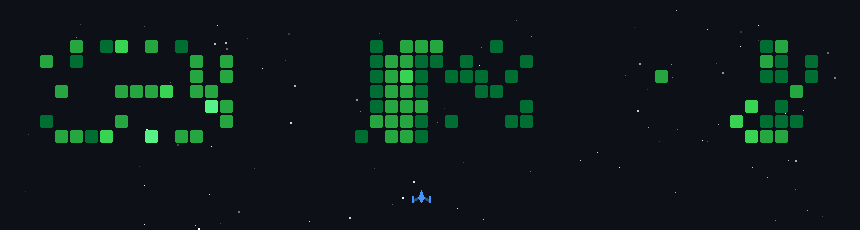

Sinh viên Công nghệ Thông tin. Học bằng cách làm dự án thật — mỗi đồ án là một bài toán phải chạy được end-to-end, không phải demo cho đẹp.

## Dự án nổi bật

| Dự án | Bài toán giải quyết | Tech stack | Repo | Demo |
|---|---|---|---|---|
| **LMS** | Nền tảng học tập trực tuyến: khoá học, bài học & tiến độ, quiz/bài tập, giỏ hàng–thanh toán, forum, phân quyền học viên–giảng viên–admin | React · Node.js (Express) · Prisma · PostgreSQL | [Repo](https://github.com/siinquyet/LMS) | — |
| **QLmobile** | Ứng dụng Android quản lý thông tin (đồ án mobile) | Kotlin | [Repo](https://github.com/siinquyet/QLmobile) | — |
| **QLSthuvienCsharp** | Phần mềm quản lý thư viện (console): thêm/xoá/sửa/tìm sách, mượn/trả, danh sách mượn trả | C# · SQL Server | [Repo](https://github.com/siinquyet/QLSthuvienCsharp) | — |

## Tech stack

**Dùng hàng ngày**

**Đã dùng qua đồ án**

## Môi trường làm việc

- Windows + VS Code, thao tác Git bằng dòng lệnh

## Contribution graph ở dạng khác

Dữ liệu commit thật của tôi được render thành game bắn phi thuyền, tự cập nhật mỗi ngày:

## Liên hệ

- Email: siinquyet@gmail.com
- GitHub: [@siinquyet](https://github.com/siinquyet)
- Facebook: [fb.com/siinquyet](https://facebook.com/siinquyet)
